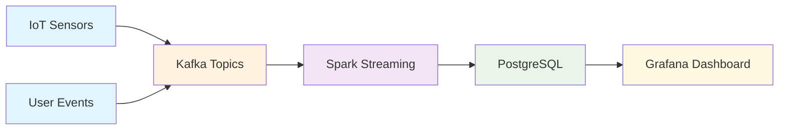

# Kafka Spark Streaming Pipeline

<div align="center">
  
  
  
  
  
  
</div>

<div align="center">
  <h3>Pipeline de Processamento de Dados em Tempo Real</h3>
  <p><em>Arquitetura distribuída para análise de dados IoT e atividade de usuários</em></p>
</div>

---

## Arquitetura do Sistema



### Fluxo de Dados
- **Ingestão**: Sensores IoT e eventos de usuários → Kafka
- **Processamento**: Spark Streaming com agregações em tempo real
- **Armazenamento**: PostgreSQL para persistência
- **Visualização**: Dashboards interativos no Grafana

## Características Principais

<table>
<tr>
<td width="50%">

### **Processamento em Tempo Real**
- Stream processing contínuo
- Latência sub-segundo
- Exactly-once processing

### **Múltiplas Fontes**
- Sensores IoT industriais
- Eventos de usuários web
- APIs externas (futuro)

### **Agregações Temporais**
- Janelas deslizantes
- Watermarks para dados atrasados
- Métricas estatísticas em tempo real

</td>
<td width="50%">

### **Detecção de Anomalias**
- Alertas automáticos
- Thresholds configuráveis
- Notificações em tempo real

### **Visualização Avançada**
- Dashboards interativos
- Métricas em tempo real
- Histórico de tendências

### **Escalabilidade**
- Arquitetura distribuída
- Auto-scaling horizontal
- Tolerância a falhas

</td>
</tr>
</table>

## Stack Tecnológica

<div align="center">

| Categoria | Tecnologia | Versão | Função |
|-----------|------------|--------|--------|
| **Message Broker** |  | 2.8+ | Streaming de dados |
| **Stream Processing** |  | 3.4+ | Processamento distribuído |
| **Database** |  | 13+ | Armazenamento persistente |
| **Monitoring** |  | 8.0+ | Visualização e dashboards |
| **Containerization** |  | 20.10+ | Orquestração de serviços |
| **Language** |  | 3.8+ | Produtores e consumidores |

</div>

## Componentes do Sistema

### Geradores de Dados
- **IoT Data Generator**: Simulação de sensores industriais (temperatura, umidade, pressão atmosférica)
- **User Activity Generator**: Simulação de eventos de usuários web (autenticação, navegação, transações)

### Engine de Processamento
- **Transformações em Tempo Real**: Enriquecimento e limpeza de dados
- **Agregações por Janela**: Cálculo de métricas estatísticas temporais
- **Sistema de Alertas**: Detecção automática de anomalias e condições críticas
- **Enriquecimento de Dados**: Categorização e conversões de unidades

### Camada de Persistência
- **PostgreSQL**: Armazenamento de dados processados e métricas agregadas
- **Checkpointing**: Garantia de processamento exactly-once com tolerância a falhas

## Guia de Execução

### 1. Inicialização da Infraestrutura
```bash
# Inicializar todos os serviços containerizados
docker-compose up -d

# Monitorar logs de inicialização
docker-compose logs -f
```

### 2. Configuração do Ambiente
```bash
# Executar script de configuração inicial
chmod +x setup.sh
./setup.sh

# Instalar dependências Python
pip install -r requirements.txt
```

### 3. Execução do Pipeline
```bash
# Terminal 1: Iniciar gerador de dados
python producers/iot_data_generator.py

# Terminal 2: Iniciar processador Spark
python consumers/spark_streaming_processor.py
```

## Monitoramento e Observabilidade

### Interfaces de Monitoramento
- **Spark Master UI**: http://localhost:8080
- **Grafana Dashboard**: http://localhost:3000 (admin/admin)
- **PostgreSQL**: localhost:5432 (postgres/postgres)

### Métricas e KPIs
- Métricas agregadas de temperatura por localização
- Alertas de condições críticas de temperatura
- Monitoramento de status de bateria dos dispositivos
- Análise de comportamento de usuários por navegador
- Métricas de duração e qualidade de sessões

## Configurações do Sistema

### Tópicos Kafka
- `iot_sensors`: Stream de dados de sensores IoT
- `user_activity`: Stream de eventos de atividade de usuários

### Parâmetros Spark Streaming
- **Intervalo de Batch**: 5 segundos
- **Watermark**: 10 minutos para dados atrasados
- **Tamanho da Janela**: 5 minutos para agregações
- **Checkpointing**: Habilitado para tolerância a falhas

### Critérios de Alerta
- **Temperatura Crítica**: Acima de 30°C
- **Bateria Baixa**: Abaixo de 20%
- **Sessão Prolongada**: Superior a 5 minutos

## Casos de Uso

1. **Monitoramento Industrial**: Supervisão de sensores em tempo real
2. **Analytics Comportamental**: Análise de padrões de usuários
3. **Detecção Proativa**: Sistema de alertas para anomalias
4. **Business Intelligence**: Dashboards executivos com KPIs

## Validação e Testes

```bash
# Verificar tópicos Kafka disponíveis
docker exec kafka kafka-topics --list --bootstrap-server localhost:9092

# Validar dados armazenados no PostgreSQL
docker exec -it postgres psql -U postgres -d streaming_data -c "SELECT COUNT(*) FROM sensor_data;"

# Monitorar logs do Spark Master
docker logs spark-master

# Verificar status dos containers
docker-compose ps
```

## Roadmap de Desenvolvimento

- [ ] Implementação de Schema Registry para versionamento
- [ ] Integração com Kafka Connect para fontes externas
- [ ] Configuração de alertas avançados no Grafana
- [ ] Desenvolvimento de modelos ML para detecção de anomalias
- [ ] Implementação de testes unitários e de integração
- [ ] Otimização de performance e tuning de parâmetros

## Tecnologias e Conceitos Demonstrados

- **Stream Processing**: Processamento de dados em tempo real
- **Event-Driven Architecture**: Arquitetura orientada a eventos
- **Real-time Analytics**: Análises e agregações temporais
- **Data Engineering**: Pipeline ETL para big data
- **Containerization**: Orquestração com Docker Compose
- **Observability**: Monitoramento e visualização de métricas


## Métricas do Projeto

<div align="center">


</div>

## Contribuições

Contribuições são bem-vindas! Sinta-se à vontade para:

- Reportar bugs
- Sugerir novas funcionalidades
- Enviar pull requests
- Dar uma estrela se gostou do projeto

## Licença

Este projeto está licenciado sob a [Licença MIT](LICENSE) - veja o arquivo LICENSE para detalhes.

## Contato

<div align="center">

**Ivan de França**  
*Engenheiro de Dados | Especialista em Stream Processing*

[](https://linkedin.com/in/seu-perfil)
[](https://github.com/01001102)
[](mailto:seu-email@exemplo.com)

</div>

---

<div align="center">
  <sub>Construído para demonstrar expertise em Data Engineering</sub>
</div> 